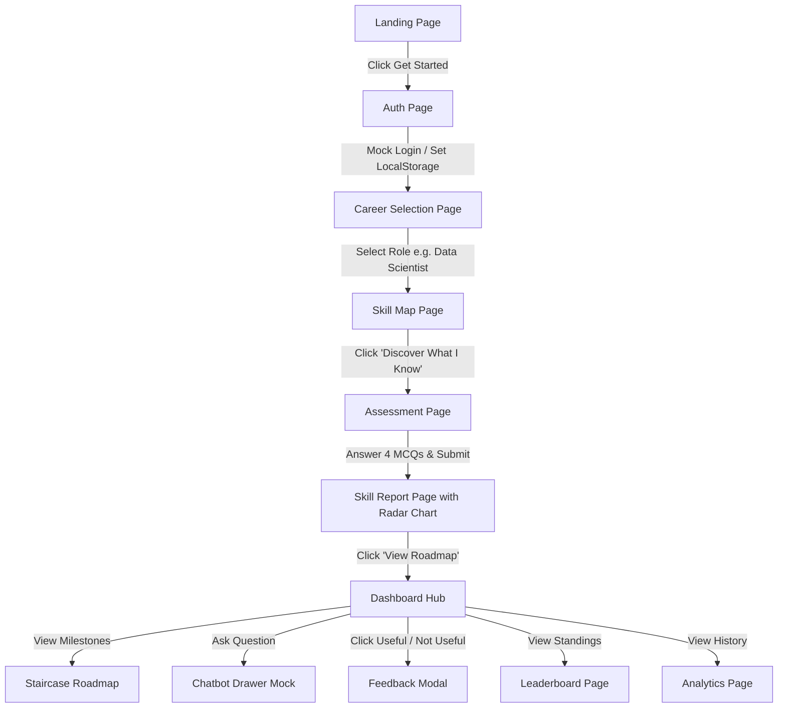
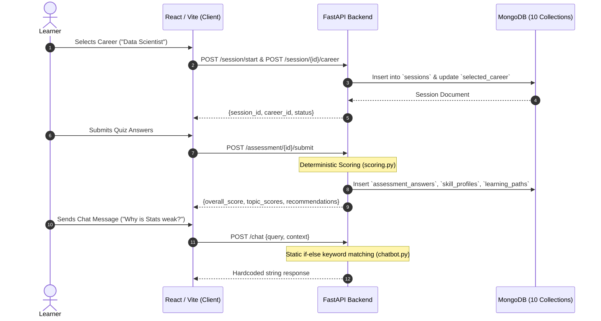
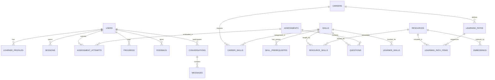
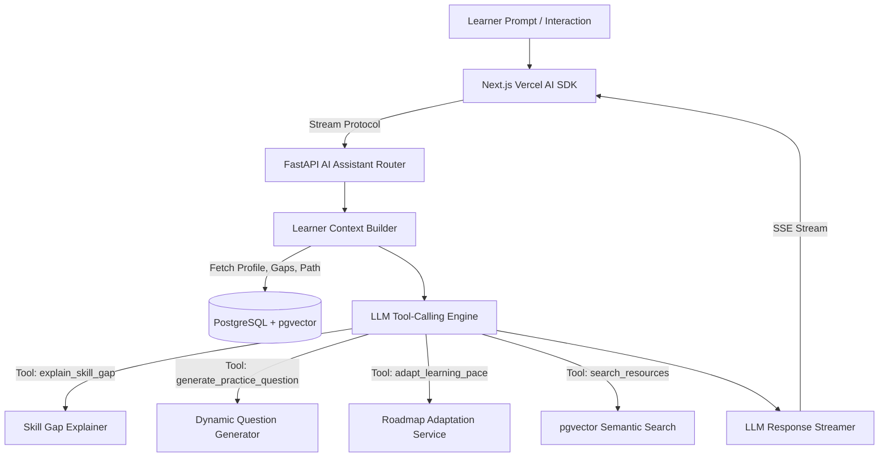
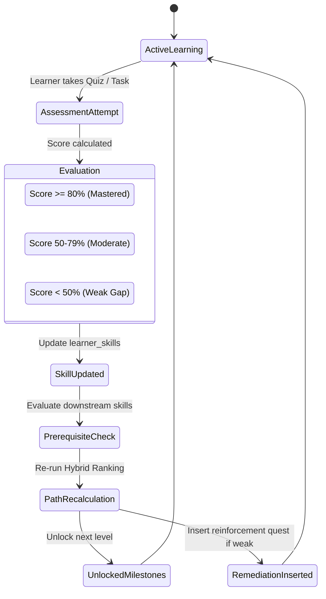

# 🧭 PATHPILOT AI — ARCHITECTURE & CODEBASE AUDIT REPORT
**Comprehensive Repository Audit & Migration Blueprint to Locked Production Stack**  
*Document Version:* `1.0.0` | *Date:* August 2026 | *Auditor Team:* Principal Architect, Senior Full-Stack, Senior AI/ML, Recommendation Systems, Data/DB, UI/UX, Cloud/DevOps, Security, QA & Competition Strategy Roles.

---

## 1. EXECUTIVE SUMMARY

An exhaustive audit of the **PathPilot** repository (`/Users/pankajkumar/Downloads/HCL-main`) was conducted across all backend services, database repositories, API routers, frontend components, state management contexts, mock dataset providers, and test suites.

### Key Audit Findings
1. **Frontend Architecture**: Built as a client-side Vite + React 18 single-page application using Tailwind CSS and Lucide icons. Navigation is entirely simulated via a state-based `activeView` string stored in `localStorage` rather than a standard URL-driven router or Next.js App Router.
2. **Backend & Database**: An asynchronous Python FastAPI service connected to **MongoDB** via `motor` and `pymongo`. It contains 10 document collections (`users`, `careers`, `courses`, `sessions`, `assessments`, `assessment_answers`, `skill_profiles`, `learning_paths`, `feedback`, `agent_traces`).
3. **AI / ML Reality Check**: **Zero genuine AI/ML exists in the current codebase.**
   - The chatbot (`backend/services/chatbot.py` and `frontend/src/services/api.ts`) is 100% hardcoded `if-elif` keyword pattern matching with pre-canned string templates referencing "Statistics" and "p-values".
   - The recommendation engine (`backend/services/recommendation.py`) is a deterministic rule-based `if score < 50` threshold loop.
   - There are no LLM invocations, no vector embeddings, no semantic retrieval, no pgvector indexes, and no machine learning models.
4. **Authentication & Identity**: The frontend bypasses real authentication by fabricating random user IDs (`usr_<random>`) stored in `localStorage`. The backend contains a Firebase Admin SDK wrapper, but with `DEV_MODE=true` hardcoded, all authorization headers fall back to `"dev-user-123"`. No real OAuth or Supabase Auth exists.
5. **Data Duplication & Hardcoding**: A 458-line frontend file (`marketIntelligence.ts`) completely duplicates career and question data independently of the backend database, allowing the frontend to run in a detached mock mode when the API fails.

### Locked Stack Migration Strategy
The platform will undergo a planned, phased migration to the **Locked Stack**:
- **Frontend**: Next.js (App Router, TypeScript, Tailwind CSS, shadcn/ui, Lucide React, Recharts, Vercel AI SDK).
- **Backend**: Python FastAPI with Pydantic v2, SQLAlchemy 2.0 (async), Alembic, NumPy, scikit-learn.
- **Database & Vector**: PostgreSQL 16 on Supabase with `pgvector` extension for semantic course/project/resource search.
- **Authentication**: Supabase Auth (JWT bearer verification in FastAPI).
- **Deployment**: Vercel (Frontend), Supabase (DB/Auth/Vector), Render/Railway (FastAPI backend).

---

## 2. CURRENT TECHNOLOGY STACK

| Layer | Technologies Currently in Use | Locked Target Stack Replacement |
| :--- | :--- | :--- |
| **Frontend Framework** | React 18.3.1 (Vite 5.4.1 SPA) | **Next.js 14+ (App Router, React Server Components, TypeScript)** |
| **Frontend Styling** | Tailwind CSS 3.4.10, Custom CSS | **Tailwind CSS + shadcn/ui Design System** |
| **Frontend Icons & Visuals**| Lucide React 0.428, Canvas-Confetti, SVG/Canvas Radar | **Lucide React, Recharts, Canvas-Confetti** |
| **AI Client SDK** | None (Custom fetch calls to static endpoint) | **Vercel AI SDK (`ai/react`, `useChat`, streaming)** |
| **Backend Framework** | FastAPI (Async), Uvicorn | **FastAPI (Async), Pydantic v2, Uvicorn (Retained & Hardened)** |
| **ORM / Data Access** | Motor 3.x, PyMongo 4.x (No ORM, raw dict queries) | **SQLAlchemy 2.0 (Async) + Alembic Migrations** |
| **Database** | MongoDB (Local / Atlas) | **PostgreSQL 16 (Relational & Normalized)** |
| **Vector Search** | None | **PostgreSQL `pgvector` (Cosine distance `<=>` indexing)** |
| **AI / ML Runtime** | Static Python scripts (Rule-based) | **Official LLM APIs (OpenAI / Anthropic / Gemini) + Embedding API + NumPy + scikit-learn** |
| **Authentication** | Firebase Admin SDK stub + Dev bypass | **Supabase Auth (JWT Verification on FastAPI)** |
| **Database Platform** | MongoDB Local (`localhost:27017`) | **Supabase Managed PostgreSQL + pgvector** |
| **Deployment** | Unconfigured local scripts | **Vercel (Frontend) + Supabase (DB/Auth) + Render/Railway (Backend)** |

---

## 3. CURRENT PROJECT STRUCTURE

```
/Users/pankajkumar/Downloads/HCL-main/
├── README.md                          # Existing project documentation
├── .gitignore                         # Standard git ignore file
├── backend/
│   ├── .env                           # Local environment config
│   ├── .env.example                   # Environment template
│   ├── requirements.txt               # Python dependencies (FastAPI, Motor, PyMongo, Firebase)
│   ├── auth.py                        # Firebase Admin SDK token verifier with DEV_MODE bypass
│   ├── database.py                    # Database accessor stub
│   ├── main.py                        # FastAPI routes, schemas, lifespan handler (631 lines)
│   ├── seed_data.py                   # Hardcoded seed careers and 4 sample questions
│   ├── database/
│   │   ├── __init__.py
│   │   ├── mongodb.py                 # AsyncIOMotorClient connection lifecycle
│   │   ├── indexes.py                 # MongoDB index setup across 10 collections
│   │   └── seed.py                    # Upsert seeder for careers and courses
│   ├── repositories/
│   │   ├── user_repository.py         # MongoDB `users` CRUD
│   │   ├── session_repository.py      # MongoDB `sessions` CRUD with ID variant handling
│   │   ├── career_repository.py       # MongoDB `careers` CRUD
│   │   ├── course_repository.py       # MongoDB `courses` CRUD
│   │   ├── assessment_repository.py   # MongoDB `assessments` & `assessment_answers` CRUD
│   │   ├── skill_repository.py        # MongoDB `skill_profiles` CRUD
│   │   ├── learning_path_repository.py# MongoDB `learning_paths` CRUD
│   │   ├── feedback_repository.py     # MongoDB `feedback` CRUD
│   │   └── agent_trace_repository.py  # MongoDB `agent_traces` audit trail CRUD
│   ├── services/
│   │   ├── chatbot.py                 # Keyword-matching response generator (Hardcoded)
│   │   ├── recommendation.py          # Deterministic skill-gap prioritizing logic
│   │   └── scoring.py                 # Percentage calculator for MCQs
│   └── tests/
│       ├── test_mongodb.py            # 14-step integration test for MongoDB & session persistence
│       └── test_fix.py                # Regression test for session ID hyphenation bug
└── frontend/
    ├── index.html                     # SPA HTML shell
    ├── package.json                   # Dependencies: React 18, Vite, Tailwind, Lucide
    ├── postcss.config.js
    ├── tailwind.config.js              # Theme tokens & custom color palette
    ├── tsconfig.json
    ├── vite.config.ts
    └── src/
        ├── App.tsx                    # Main layout switcher based on activeView state
        ├── main.tsx                   # React DOM render root
        ├── index.css                  # Global styles, glassmorphism utilities
        ├── context/
        │   └── AuthContext.tsx        # localStorage-based user & session state context
        ├── types/
        │   └── index.ts               # Core TypeScript interfaces (User, Career, Skill, etc.)
        ├── services/
        │   ├── api.ts                 # Backend fetch client with fallback to mock data
        │   └── marketIntelligence.ts  # Massive 458-line hardcoded role and question catalog
        ├── components/
        │   ├── Navbar.tsx             # Global navigation bar with user badge and XP
        │   ├── Sidebar.tsx            # Left navigation rail
        │   ├── StaircaseMap.tsx       # Gamified roadmap visualization with anime hero avatar
        │   ├── RadarChart.tsx         # SVG Radar chart for skill strengths
        │   ├── LearningHeatmap.tsx    # GitHub-style activity contribution calendar
        │   ├── ChatbotDrawer.tsx      # Slide-out AI chat drawer
        │   └── FeedbackModal.tsx      # Milestone recommendation feedback popup
        └── pages/
            ├── LandingPage.tsx        # Marketing landing page with hero copy
            ├── AuthPage.tsx           # Login / Signup form (Mocks user creation)
            ├── CareerSelectionPage.tsx# Category-filtered career grid with search
            ├── SkillMapPage.tsx       # Industry expectation skill tree breakdown
            ├── AssessmentPage.tsx     # Timed multiple-choice quiz runner
            ├── SkillReportPage.tsx    # Assessment results with radar chart & gaps
            ├── DashboardPage.tsx      # Main learner hub (Daily quest, Staircase, feedback)
            ├── LeaderboardPage.tsx    # Mock gamified user standings table
            ├── AnalyticsPage.tsx      # Heatmap & growth trend charts
            └── SettingsPage.tsx       # Profile and daily goal settings
```

---

## 4. EXISTING FEATURES

1. **Career Goal Discovery**: Browse 8+ technology careers (Data Scientist, AI Engineer, Full Stack Developer, Cloud Engineer, etc.) categorized by industry domain.
2. **Skill Tree Visualization**: Visual display of skills required per career organized by level (Foundation, Core Skills, Advanced Skills, Industry Readiness) with estimated completion times.
3. **Interactive MCQ Assessment**: Timed multiple-choice quiz testing core skills for selected careers.
4. **Competency Evaluation & Skill Gap Calculation**: Automatic grouping of assessment results into Strong (>=80%), Moderate (50-79%), and Weak (<50%) skill areas.
5. **Radar Chart Competency Map**: Interactive SVG radar polygon rendering multi-axis capability scores.
6. **Milestone Learning Roadmap ("Staircase Map")**: Gamified progression map showing unlocked, active, and locked milestones with an animated Hero Avatar.
7. **Daily Quest Tracker**: Pacing and study goal cards (10m, 20m, 45m daily study goals) granting XP.
8. **Slide-Out Chatbot Companion**: Chat interface offering advice on weak topics and study next-steps.
9. **Milestone Recommendation Feedback**: Useful / Not Useful feedback buttons that dynamically alter milestone pacing (e.g. extending hours or completing steps).
10. **Gamification & Leaderboard**: XP points, daily streak counters, rank medals, and guild leaderboard.
11. **Activity Heatmap**: 28-day simulated learning contribution grid.
12. **Multi-Collection MongoDB Persistence**: Session recovery, trace logging, and idempotency tests across 10 collections.

---

## 5. FEATURE IMPLEMENTATION STATUS

| Feature | Current Status | Underlying Implementation Mechanism | Target Locked Stack Plan |
| :--- | :--- | :--- | :--- |
| **Landing & Marketing Flow** | **COMPLETE** | React UI + Tailwind + CSS Keyframe Animations | Next.js Page + Tailwind + shadcn/ui |
| **User Authentication** | **MOCKED** | Frontend generates random `usr_` in `localStorage`; backend has `DEV_MODE=true` bypass | **Supabase Auth (OAuth/Email + JWT verification)** |
| **Career Exploration** | **COMPLETE** | Seeded in MongoDB + duplicated in frontend `marketIntelligence.ts` | Dynamic PostgreSQL `careers` table queried via FastAPI |
| **Skill Prerequisite Graph** | **PARTIAL** | Flat array of prerequisite string IDs in MongoDB documents | Normalized `skill_prerequisites` table + DAG validation |
| **Assessment Delivery** | **PARTIAL** | Only 4 questions total in backend seed; frontend has fallback questions | Dynamic `questions` table in PostgreSQL by difficulty/skill |
| **Assessment Scoring** | **COMPLETE** | Percentage calculation by topic in `backend/services/scoring.py` | FastAPI scoring service + historic `assessment_attempts` |
| **Skill-Gap Analysis** | **RULE-BASED**| `<50%` weak threshold classification | Hybrid Skill-Gap Engine with weighted readiness score |
| **Radar Chart Visualization** | **COMPLETE** | Custom SVG polar math in `RadarChart.tsx` | Recharts `RadarChart` / Native SVG with smooth transitions |
| **Learning Path Generation** | **RULE-BASED**| Sorts skills by level; weak topics marked High Priority | Hybrid Ranking Algorithm (Relevance + Gap + Prerequisites) |
| **Gamified Roadmap UI** | **COMPLETE** | `StaircaseMap.tsx` with animated SVG anime hero avatar & confetti | Retain & enhance gamified UI with rich milestone nodes |
| **Resource Catalog** | **HARDCODED** | 12 hardcoded courses in MongoDB `courses` collection; courses only | Multi-type `resources` (Course, Project, Video, Doc, Practice) |
| **AI Assistant / Chatbot** | **HARDCODED** | String `if "why" in query:` in `chatbot.py` (No LLM) | **Vercel AI SDK + LLM API + Learner Context Tool Calling** |
| **Vector Search / Embeddings**| **MISSING** | Non-existent; no embedding models or vector databases | **PostgreSQL `pgvector` + Text Embeddings API** |
| **Semantic Retrieval** | **MISSING** | Non-existent | Cosine distance similarity `<=>` against learner profile |
| **Adaptive Learning Loop** | **HARDCODED** | Increases estimated hours by +3 or marks complete on button click | Dynamic Bayesian/Weighted adaptation on quiz retry & feedback |
| **Gamification (XP/Streak)** | **PARTIAL** | Frontend state mutated locally; not persisted per user in DB | PostgreSQL `learner_profiles` table tracking XP, streak, badges |
| **Activity Heatmap** | **HARDCODED** | 28-day hardcoded math loop in `LearningHeatmap.tsx` | PostgreSQL `progress` table aggregating daily study logs |
| **Leaderboard** | **HARDCODED** | Static JSON list in `main.py` (`get_leaderboard`) | Dynamic PostgreSQL query ordering users by `xp` |

---

## 6. CURRENT USER FLOW



### Critical Gaps in Current Flow:
1. **No Learner Onboarding / Goal Customization**: The user cannot describe their background, years of experience, or learning preferences in natural language.
2. **Disconnected Authentication**: If the user opens another browser or clears cache, all progress is wiped because state is anchored to browser `localStorage`.
3. **Static Assessment**: Every user receives the same 4 questions regardless of claimed experience level.
4. **No Actual Learning Resources**: Clicking a roadmap milestone does not link to real projects, tutorials, documentation, or interactive code practice.

---

## 7. CURRENT DATA FLOW



---

## 8. CURRENT AI/ML AUDIT

A rigorous line-by-line inspection was executed to verify every claim of artificial intelligence:

| AI/ML Dimension | Claimed in Documentation | Code Inspection Result | Verdict |
| :--- | :--- | :--- | :--- |
| **LLM Integration** | "AI Career Copilot" | `backend/services/chatbot.py`: Lines 13-48 are `if "why" in query_lower:... elif "next" in query_lower:...`. No API calls to OpenAI, Anthropic, Gemini, or local models. | ❌ **100% Fake / Hardcoded** |
| **Embeddings** | "Semantic Search" | Zero references to embeddings, sentence-transformers, or vector arrays in any file. | ❌ **Completely Missing** |
| **Vector Database** | "Vector DBs & RAG" | Mentioned only as a career skill topic string in `seed_data.py`; no vector DB client exists. | ❌ **Non-Existent** |
| **Recommendation Engine**| "AI-Powered Adaptive Engine"| `backend/services/recommendation.py`: Simple filter comparing `score < 50` and sorting by `level`. | ❌ **Rule-Based Only** |
| **Skill Gap Analysis** | "Multi-Agent AI Analysis" | `backend/services/scoring.py`: Basic `(correct / total) * 100` percentage calculation. | ❌ **Basic Arithmetic** |
| **Multi-Agent Simulation**| "Profile Agent, Assessment Agent, etc." | `agent_trace_repository.py`: Just writes arbitrary string tags (`"Assessment Agent"`, `"Profile Agent"`) to a MongoDB array. No actual autonomous agents exist. | ❌ **Cosmetic Audit Trail** |

---

## 9. CURRENT RECOMMENDATION ENGINE AUDIT

### Existing Logic (`backend/services/recommendation.py`):
```python
# Actual Code Summary:
for skill in sorted_skills:
    score = user_skill_scores.get(skill_id, 0.0)
    if score > 0 and score < 50.0:
        priority = "High"
        reason = f"Recommended because your assessment score in {skill['name']} is {score:.0f}% (Weak Area)."
    elif score >= 50.0 and score < 80.0:
        priority = "Medium"
        reason = f"Recommended because improving {skill['name']} from {score:.0f}% will unlock your Career Readiness goal."
    elif score == 0.0 and prereqs_met:
        priority = "Medium"
        reason = f"Recommended because you have mastered the prerequisites for {skill['name']}."
```

### Critical Flaws in Current Recommendation Engine:
1. **Zero Multi-Factor Scoring**: Ignores resource type, learner format preference (video vs project), time availability, semantic relevance, or market demand.
2. **No Cold-Start Candidate Retrieval**: If a user does not take an assessment, every skill has `score = 0.0` and receives a generic reason.
3. **No Diversity or Resource Blending**: Only outputs the skill title itself, never concrete actionable resources (courses, GitHub projects, documentation, exercises).
4. **No True Adaptation**: Feedback only adds static strings or increments static numbers (+3 hours).

---

## 10. CURRENT CHATBOT/AI ASSISTANT AUDIT

### Existing Logic (`backend/services/chatbot.py`):
```python
def answer_user_query(query: str, user_context: Dict[str, Any]) -> str:
    query_lower = query.lower()
    if "why" in query_lower and ("weak" in query_lower or "score" in query_lower):
        return "...For example, in Statistics, p-value interpretations and distribution skewness were missed..."
    elif "next" in query_lower or "study" in query_lower:
        return "Based on your goal to become a {career_name}, here is your optimal next focus..."
    elif "practice" in query_lower:
        return "Q: In a dataset with extreme outliers, which metric is most resistant to extreme high values?"
    else:
        return "I'm your PathPilot AI Assistant!..."
```

### Critical Flaws:
- Hardcodes statistical questions about "outliers" and "medians" even if the learner selected *Cybersecurity* or *Full Stack Developer*.
- Cannot answer technical questions about code, syntax, concepts, or project blockers.
- Cannot stream tokens to the UI.
- Has no memory of previous conversation turns.

---

## 11. CURRENT ASSESSMENT & SKILL-GAP ENGINE AUDIT

1. **Question Catalog**: The backend seed dataset contains only **4 questions in total** across all career paths (1 Python, 1 Statistics, 1 AI/LLM, 1 Terraform).
2. **Fallback Behavior**: When a user selects *Data Analyst*, *Cybersecurity*, or *Web Developer*, the backend falls back to `QUESTIONS_DATA[:4]`, serving Terraform and Python questions to cybersecurity and data analyst students.
3. **No Difficulty Adaptivity**: Does not adapt question difficulty based on prior answers (Item Response Theory / dynamic branching).
4. **Binary Scoring**: Treats all questions with equal weight without penalizing guessing or rewarding advanced concept mastery.

---

## 12. CURRENT ADAPTIVE LEARNING AUDIT

### Existing Adaptation Implementation:
In `backend/main.py` lines 553-569:
- If feedback is `"too_easy"`: sets milestone status to `"completed"` and appends `" (Marked as too easy by learner)"` to the reasoning string.
- If feedback is `"too_hard"`: adds 3 hours to `estimated_hours` (`m["estimated_hours"] = (m.get("estimated_hours") or 5) + 3`).

### Deficiencies:
- Does not recommend alternative prerequisite resources for struggling learners.
- Does not accelerate advanced learners to capstone projects.
- Does not recalculate the skill readiness score when milestones are updated.

---

## 13. CURRENT DATABASE MODEL

The current database is **MongoDB** (`path_pilot` database) with 10 collections:

```
MongoDB: path_pilot
├── users                   # {_id, firebase_uid, email, display_name, profile, created_at, updated_at}
├── careers                 # {_id, career_id, name, category, description, icon, skills, skill_weights}
├── courses                 # {_id, course_id, title, description, skills_taught, prerequisites, difficulty}
├── sessions                # {_id, session_id, learner_id, firebase_uid, selected_career, learning_path, ...}
├── assessments             # {_id, assessment_id, session_id, firebase_uid, career_id, questions, status}
├── assessment_answers      # {_id, assessment_id, session_id, question_id, skill, selected_option, is_correct}
├── skill_profiles          # {_id, session_id, firebase_uid, career_id, skills: {skill_id: {score, level}}}
├── learning_paths          # {_id, session_id, firebase_uid, career_id, milestones: [...]}
├── feedback                # {_id, session_id, firebase_uid, milestone_order, feedback_type, created_at}
└── agent_traces            # {_id, session_id, firebase_uid, events: [{agent, message, timestamp}]}
```

### Relational & Normalization Flaws in MongoDB Schema:
1. **Unbounded Embedded Arrays**: `skills` inside `careers`, `milestones` inside `learning_paths`, and `events` inside `agent_traces` grow indefinitely in single documents.
2. **Denormalized Session Bloat**: `sessions` stores copies of `learner_profile`, `assessment_result`, `skill_gaps`, and `learning_path`, causing data inconsistency when individual collections are updated.
3. **No Foreign Key Integrity**: Deleting a user does not cascade or enforce relationship integrity with sessions or assessments.
4. **No Vector Indexing**: MongoDB is not configured for vector embeddings.

---

## 14. CURRENT AUTHENTICATION & SECURITY AUDIT

### Security Findings:
1. **Bypassed Authorization**:
   - `backend/auth.py` defaults `DEV_MODE = True`.
   - When no token is passed, it sets `firebase_uid = "dev-user-123"`.
   - Anyone can impersonate any user or read/write any session without authentication.
2. **Frontend Mock Identity**:
   - `frontend/src/context/AuthContext.tsx` generates `usr_<random>` in `localStorage`.
   - The frontend never attaches `Bearer <token>` to its fetch requests in `api.ts`.
3. **CORS Misconfiguration**:
   - `main.py` has `allow_origins=["*"]` with `allow_credentials=True`. This is a security risk in production.
4. **No Rate Limiting or Input Sanitization**:
   - Endpoints have no rate limiters on assessment submission or chat endpoints.

---

## 15. FRONTEND AUDIT

### Strengths to Preserve:
- **Visual Design & Aesthetics**: Clean palette, gradient badges, smooth card hover effects, and modern dark-mode landing accents.
- **Staircase Gamification**: The milestone roadmap in `StaircaseMap.tsx` with anime avatar and step-by-step unlocked states is visually compelling and demo-friendly.
- **SVG Radar Chart**: Fast, dependency-free polar chart rendering.
- **Micro-Interactions**: Confetti animations on milestone completion (`canvas-confetti`).

### Deficiencies to Overhaul:
- **No Real Routing**: Entire app runs in `App.tsx` via `activeView === 'dashboard'` conditional rendering. Direct URLs (e.g. `/dashboard`, `/assessment/data-scientist`) cannot be bookmarked or shared.
- **Client-Side Data Duplication**: `marketIntelligence.ts` contains 458 lines of hardcoded career and question definitions instead of consuming backend APIs.
- **No Streaming AI**: Chat drawer waits for a full JSON payload rather than streaming LLM tokens.
- **No shadcn/ui Component Primitives**: Buttons, inputs, modals, and dialogs are custom-crafted with repeated ad-hoc Tailwind classes.

---

## 16. BACKEND AUDIT

### Strengths:
- Clean modular structure with dedicated `repositories/`, `services/`, and `database/` folders.
- Async I/O throughout FastAPI endpoints using `async/await`.
- Automated test script `test_mongodb.py` verifying multi-step persistence.

### Deficiencies:
- **No ORM or Schema Management**: Direct dictionary mutations with PyMongo; no type-safe database queries.
- **No Vector Search**: Lacks embedding generation, cosine similarity, or vector indexing.
- **Redundant Route Aliases**: Multiple duplicated route paths (e.g. `/api/careers` and `/careers`, `/api/chat`, `/chat`, `/api/chatbot`, `/api/chatbot/ask`) indicating inconsistent API contracts.

---

## 17. TESTING AUDIT

- **Existing Tests**: Two test files (`test_mongodb.py` with 14 assertions, and `test_fix.py`).
- **Test Coverage Gaps**:
  - 0 unit tests for recommendation scoring math.
  - 0 tests for LLM prompt generation or structured schema validation.
  - 0 frontend unit or component tests (no Jest, Vitest, or React Testing Library setup).
  - 0 end-to-end browser tests (no Playwright or Cypress).

---

## 18. DEPLOYMENT AUDIT

- Currently configured strictly for local execution (`localhost:8000` and `localhost:5173`).
- No `Dockerfile`, `docker-compose.yml`, Vercel configuration (`vercel.json`), or CI/CD workflow (`.github/workflows`).
- Environment variables contain MongoDB connection strings rather than PostgreSQL / Supabase connection strings.

---

## 19. PROBLEMS / TECHNICAL DEBT SUMMARY

1. **Fake AI**: Chatbot and recommendations are hardcoded `if-else` scripts.
2. **Wrong Database Stack**: MongoDB instead of the locked **PostgreSQL + pgvector (Supabase)**.
3. **Wrong Frontend Stack**: Vite SPA instead of the locked **Next.js App Router + shadcn/ui + Vercel AI SDK**.
4. **Mocked Authentication**: `localStorage` user generator instead of **Supabase Auth**.
5. **Hardcoded Course Catalog**: Only 12 courses; no hands-on projects, assessments, documentation, or articles.
6. **No Vector Embeddings**: Missing semantic search pipeline.
7. **Client-Side State Routing**: No server-side rendering, SEO metadata, or bookmarkable URLs.

---

## 20. WHAT SHOULD BE KEPT

1. **Gamified Visual Concepts**: The Staircase Roadmap layout, milestone locking mechanic, and anime hero avatar.
2. **Competency Categorization**: Division into *Foundation*, *Core Skills*, *Advanced Skills*, and *Industry Readiness*.
3. **Threshold Classification**: Strong (>=80%), Moderate (50-79%), Weak (<50%) skill categorization (as a baseline signal).
4. **Domain Content**: Curated tech tracks (Data Scientist, AI Engineer, Full Stack, Cloud, DevOps, Cybersecurity).
5. **Interactive Radar Chart & Heatmap Visuals**: Radar geometry and activity heatmap UI concepts.

---

## 21. WHAT SHOULD BE REPLACED

1. **MongoDB & Motor** $\rightarrow$ **PostgreSQL 16 + SQLAlchemy 2.0 (Async) + Alembic**.
2. **Vite SPA** $\rightarrow$ **Next.js 14+ App Router with TypeScript**.
3. **Hardcoded Chatbot (`chatbot.py`)** $\rightarrow$ **FastAPI LLM Service + Vercel AI SDK (`useChat`) with Streaming & Tool Calling**.
4. **Rule-Based Recommendation (`recommendation.py`)** $\rightarrow$ **Hybrid Multi-Factor Recommendation Pipeline (pgvector + Skill Gap + Prerequisites)**.
5. **Mock Auth (`AuthContext.tsx`)** $\rightarrow$ **Supabase Auth (SSR + Client SDK + FastAPI JWT Bearer)**.
6. **Custom UI Primitives** $\rightarrow$ **shadcn/ui Design System**.

---

## 22. WHAT SHOULD BE MIGRATED

1. **Career & Skill Taxonomies**: Convert existing JSON/Mongo career structures into relational SQL tables (`careers`, `skills`, `career_skills`, `skill_prerequisites`).
2. **Course Catalog**: Expand the 12 existing courses into multi-type `resources` (Courses, Projects, Assessments, Articles, Videos, Practices).
3. **Assessment Question Bank**: Migrate seed questions into relational `questions` and `assessments` tables.
4. **Tailwind Design Tokens**: Port color variables and glassmorphism CSS from Vite `tailwind.config.js` to Next.js design system.

---

## 23. WHAT SHOULD BE REMOVED

1. `backend/database/mongodb.py`, `backend/database/indexes.py`, `backend/database/seed.py` (MongoDB specific).
2. All PyMongo/Motor dependencies from `requirements.txt`.
3. `backend/auth.py` Firebase Admin SDK mock bypass code.
4. `frontend/src/services/marketIntelligence.ts` (458 lines of hardcoded client-side duplicate data).
5. Unused route aliases in `backend/main.py`.

---

## 24. TARGET ARCHITECTURE

```
                                  ┌────────────────────────────────────────────────────────┐
                                  │                  NEXT.JS 14+ FRONTEND                  │
                                  │   (App Router, TypeScript, Tailwind CSS, shadcn/ui)    │
                                  │                                                        │
                                  │   ┌──────────────────────┐  ┌──────────────────────┐   │
                                  │   │    Vercel AI SDK     │  │   Recharts / Radar   │   │
                                  │   │ (Streaming Chatbot)  │  │  (Interactive Maps)  │   │
                                  │   └──────────┬───────────┘  └──────────────────────┘   │
                                  └──────────────┼───────────────────────────┬─────────────┘
                                                 │ Streaming                   │ REST / JSON
                                                 ▼                             ▼
┌──────────────────────────────────────────────────────────────────────────────────────────┐
│                                 FASTAPI ASYNC BACKEND                                    │
│                                                                                          │
│  ┌────────────────────────┐  ┌─────────────────────────┐  ┌───────────────────────────┐  │
│  │   Supabase Auth Guard  │  │  Skill-Gap & Graph      │  │    Hybrid Recommendation  │  │
│  │    (JWT Verification)  │  │  Prerequisite Engine    │  │    Engine (pgvector + ML) │  │
│  └────────────────────────┘  └─────────────────────────┘  └───────────────────────────┘  │
│  ┌────────────────────────┐  ┌─────────────────────────┐  ┌───────────────────────────┐  │
│  │   LLM Agent Service    │  │  SQLAlchemy 2.0 Async   │  │   Embedding Pipeline      │  │
│  │   (Contextual Mentor)  │  │  ORM & Repository Layer │  │   (OpenAI / Gemini)       │  │
│  └───────────┬────────────┘  └────────────┬────────────┘  └─────────────┬─────────────┘  │
└──────────────┼────────────────────────────┼─────────────────────────────┼────────────────┘
               │                            │                             │
               │                            ▼                             │
               │               ┌───────────────────────────┐              │
               │               │   SUPABASE POSTGRESQL 16  │              │
               │               │                           │              │
               │               │  - Normalized Relational  │              │
               │               │    Schema                 │              │
               │               │  - pgvector Cosine Index  │◄─────────────┘
               │               │  - Supabase Auth Tables   │
               │               │  - Row Level Security     │
               │               └───────────────────────────┘
               ▼
┌───────────────────────────────┐
│     EXTERNAL AI SERVICES      │
│  - LLM API (GPT-4o / Gemini)  │
│  - Embeddings (text-embed-3)  │
└───────────────────────────────┘
```

---

## 25. TARGET DATABASE SCHEMA (PostgreSQL + pgvector)



### Table Definitions & Constraints:

1. **`users`**:
   - `id` (UUID, PK, matches Supabase `auth.users.id`)
   - `email` (VARCHAR, UNIQUE, NOT NULL)
   - `display_name` (VARCHAR)
   - `avatar_url` (VARCHAR)
   - `created_at`, `updated_at` (TIMESTAMPTZ)
2. **`learner_profiles`**:
   - `id` (UUID, PK)
   - `user_id` (UUID, FK -> `users.id`, UNIQUE)
   - `target_career_id` (UUID, FK -> `careers.id`)
   - `experience_level` (VARCHAR: 'beginner', 'intermediate', 'advanced')
   - `learning_pace` (VARCHAR: 'casual', 'moderate', 'intensive')
   - `preferred_format` (VARCHAR: 'interactive', 'video', 'reading', 'projects')
   - `weekly_hours_goal` (INT)
   - `xp` (INT DEFAULT 0)
   - `streak_days` (INT DEFAULT 0)
   - `last_active_at` (TIMESTAMPTZ)
3. **`careers`**:
   - `id` (UUID, PK)
   - `slug` (VARCHAR, UNIQUE, e.g. `data-scientist`)
   - `name` (VARCHAR, NOT NULL)
   - `category` (VARCHAR, NOT NULL)
   - `description` (TEXT)
   - `icon` (VARCHAR)
   - `market_demand_score` (INT)
   - `salary_range` (VARCHAR)
4. **`skills`**:
   - `id` (UUID, PK)
   - `slug` (VARCHAR, UNIQUE, e.g. `python-ds`)
   - `name` (VARCHAR, NOT NULL)
   - `category` (VARCHAR: 'Foundation', 'Core Skills', 'Advanced Skills', 'Industry Readiness')
   - `difficulty` (VARCHAR: 'Beginner', 'Intermediate', 'Advanced')
   - `level` (INT)
   - `description` (TEXT)
   - `estimated_minutes` (INT)
5. **`career_skills`**:
   - `career_id` (UUID, FK -> `careers.id`)
   - `skill_id` (UUID, FK -> `skills.id`)
   - `weight` (FLOAT DEFAULT 1.0)
   - `is_mandatory` (BOOLEAN DEFAULT TRUE)
   - PK(`career_id`, `skill_id`)
6. **`skill_prerequisites`**:
   - `skill_id` (UUID, FK -> `skills.id`)
   - `prerequisite_skill_id` (UUID, FK -> `skills.id`)
   - PK(`skill_id`, `prerequisite_skill_id`)
7. **`resources`**:
   - `id` (UUID, PK)
   - `title` (VARCHAR, NOT NULL)
   - `description` (TEXT)
   - `resource_type` (VARCHAR: 'course', 'project', 'assessment', 'article', 'video', 'documentation', 'practice')
   - `url` (VARCHAR)
   - `difficulty` (VARCHAR: 'Beginner', 'Intermediate', 'Advanced')
   - `estimated_minutes` (INT)
   - `provider` (VARCHAR)
   - `is_interactive` (BOOLEAN DEFAULT FALSE)
8. **`resource_skills`**:
   - `resource_id` (UUID, FK -> `resources.id`)
   - `skill_id` (UUID, FK -> `skills.id`)
   - `relevance_score` (FLOAT DEFAULT 1.0)
   - PK(`resource_id`, `skill_id`)
9. **`assessments`**:
   - `id` (UUID, PK)
   - `career_id` (UUID, FK -> `careers.id`)
   - `title` (VARCHAR)
   - `total_questions` (INT)
   - `passing_score` (FLOAT DEFAULT 70.0)
10. **`questions`**:
    - `id` (UUID, PK)
    - `assessment_id` (UUID, FK -> `assessments.id`)
    - `skill_id` (UUID, FK -> `skills.id`)
    - `difficulty` (VARCHAR)
    - `question_text` (TEXT, NOT NULL)
    - `options` (JSONB, NOT NULL)
    - `correct_answer_index` (INT, NOT NULL)
    - `explanation` (TEXT)
11. **`learner_skills`**:
    - `id` (UUID, PK)
    - `user_id` (UUID, FK -> `users.id`)
    - `skill_id` (UUID, FK -> `skills.id`)
    - `score` (FLOAT DEFAULT 0.0)
    - `status` (VARCHAR: 'locked', 'ready', 'in_progress', 'mastered')
    - `last_assessed_at` (TIMESTAMPTZ)
    - UNIQUE(`user_id`, `skill_id`)
12. **`assessment_attempts`**:
    - `id` (UUID, PK)
    - `user_id` (UUID, FK -> `users.id`)
    - `assessment_id` (UUID, FK -> `assessments.id`)
    - `overall_score` (FLOAT)
    - `topic_breakdown` (JSONB)
    - `submitted_answers` (JSONB)
    - `completed_at` (TIMESTAMPTZ)
13. **`learning_paths`**:
    - `id` (UUID, PK)
    - `user_id` (UUID, FK -> `users.id`)
    - `career_id` (UUID, FK -> `careers.id`)
    - `generated_at` (TIMESTAMPTZ)
    - `status` (VARCHAR: 'active', 'completed', 'archived')
14. **`learning_path_items`**:
    - `id` (UUID, PK)
    - `learning_path_id` (UUID, FK -> `learning_paths.id`)
    - `resource_id` (UUID, FK -> `resources.id`)
    - `skill_id` (UUID, FK -> `skills.id`)
    - `step_order` (INT)
    - `status` (VARCHAR: 'locked', 'available', 'completed', 'skipped')
    - `recommendation_reason` (TEXT)
    - `completed_at` (TIMESTAMPTZ)
15. **`progress`**:
    - `id` (UUID, PK)
    - `user_id` (UUID, FK -> `users.id`)
    - `resource_id` (UUID, FK -> `resources.id`)
    - `time_spent_minutes` (INT)
    - `status` (VARCHAR: 'started', 'completed')
    - `logged_at` (TIMESTAMPTZ)
16. **`feedback`**:
    - `id` (UUID, PK)
    - `user_id` (UUID, FK -> `users.id`)
    - `learning_path_item_id` (UUID, FK -> `learning_path_items.id`)
    - `feedback_type` (VARCHAR: 'too_easy', 'too_hard', 'useful', 'not_useful', 'irrelevant')
    - `notes` (TEXT)
    - `created_at` (TIMESTAMPTZ)
17. **`conversations`** & **`messages`**:
    - `conversations`: `id`, `user_id`, `title`, `created_at`
    - `messages`: `id`, `conversation_id`, `role` ('user', 'assistant', 'system', 'tool'), `content` (TEXT), `tool_calls` (JSONB), `created_at`
18. **`embeddings`**:
    - `id` (UUID, PK)
    - `entity_type` (VARCHAR: 'resource', 'skill', 'question')
    - `entity_id` (UUID)
    - `embedding` (vector(1536))
    - `content_hash` (VARCHAR)
    - `updated_at` (TIMESTAMPTZ)

---

## 26. TARGET AI/ML ARCHITECTURE



### Deterministic vs. AI Division of Responsibility:
- **FastAPI Backend (Deterministic)**: Graph topological sorting of skill prerequisites, MCQ grading, mathematical skill-gap scoring, constraint validation (preventing access to locked milestones).
- **LLM Engine (Generative / Conversational)**: Explaining why a skill was recommended, personalized tutoring on confusing concepts, formulating context-specific practice questions, and providing empathetic study strategies.

---

## 27. TARGET RECOMMENDATION PIPELINE

The hybrid recommendation engine executes a 5-stage pipeline:

```
Stage 1: Candidate Generation (All resources teaching target career skills)
Stage 2: Deterministic Prerequisite & Status Filtering (Filter out mastered or locked items)
Stage 3: Multi-Factor Scoring Formula
Stage 4: Ranking & Diversity Optimization (Ensure mix of courses, projects, and exercises)
Stage 5: LLM Explanation Generation ("Why this resource is recommended for you")
```

### Mathematical Scoring Formula:
$$\text{Score}(R, U) = w_1 \cdot S_{\text{goal}} + w_2 \cdot S_{\text{gap}} + w_3 \cdot S_{\text{semantic}} + w_4 \cdot S_{\text{prereq}} + w_5 \cdot S_{\text{diff}} + w_6 \cdot S_{\text{format}} + w_7 \cdot S_{\text{feedback}}$$

- **Goal Relevance ($w_1 = 0.30$)**: Weight of the taught skill in the selected career track.
- **Skill Gap Relevance ($w_2 = 0.25$)**: $(100 - \text{CurrentScore})/100$. Larger gaps yield higher priority.
- **Semantic Similarity ($w_3 = 0.15$)**: Cosine similarity between learner goal embedding and resource embedding via pgvector:
  $$\text{Sim}(\vec{u}, \vec{r}) = 1 - (\vec{u} \cdot \vec{r}) / (\|\vec{u}\| \|\vec{r}\|)$$
- **Prerequisite Readiness ($w_4 = 0.10$)**: $1.0$ if all prerequisite skills have score $\ge 75\%$, $0.0$ otherwise.
- **Difficulty Fit ($w_5 = 0.10$)**: Match between learner experience level and resource difficulty.
- **Format Match ($w_6 = 0.05$)**: Preference match for project vs video vs interactive practice.
- **Feedback Adjustment ($w_7 = 0.05$)**: Penalty for rejected topics, boost for highly rated resource types.

---

## 28. TARGET ADAPTIVE LEARNING PIPELINE



1. **Positive Adaptation (Acceleration)**: When a learner scores $\ge 85\%$ on an assessment, intermediate tutorials are skipped and capstone project milestones are unlocked immediately.
2. **Negative Adaptation (Remediation)**: When a learner scores $< 50\%$ or flags a milestone as `"too_hard"`, the engine inserts foundational micro-lessons and documentation primers before re-attempting the milestone.

---

## 29. TARGET FRONTEND ARCHITECTURE (Next.js App Router)

```
frontend/
├── app/
│   ├── (auth)/
│   │   ├── login/page.tsx
│   │   └── signup/page.tsx
│   ├── (dashboard)/
│   │   ├── layout.tsx                 # Authenticated shell (Sidebar, Navbar, ChatDrawer)
│   │   ├── dashboard/page.tsx         # Main hub (Today's Quest, Staircase, Summary)
│   │   ├── careers/
│   │   │   ├── page.tsx               # Career track selector
│   │   │   └── [slug]/page.tsx        # Career skill tree details
│   │   ├── assessment/
│   │   │   └── [careerSlug]/page.tsx  # Dynamic quiz engine
│   │   ├── report/
│   │   │   └── [attemptId]/page.tsx   # Skill gap analysis & radar chart
│   │   ├── roadmap/page.tsx           # Full interactive milestone path
│   │   ├── leaderboard/page.tsx       # Live user rankings
│   │   ├── analytics/page.tsx         # Heatmap & growth metrics
│   │   └── settings/page.tsx          # Profile & preferences
│   ├── api/
│   │   └── chat/route.ts              # Edge-compatible Vercel AI SDK proxy
│   ├── layout.tsx                     # Root layout, Supabase Auth Provider, Toast
│   └── page.tsx                       # High-converting landing page
├── components/
│   ├── ui/                            # shadcn/ui components (Button, Dialog, Card, Progress)
│   ├── roadmap/
│   │   ├── StaircaseMap.tsx           # Enhanced gamified roadmap
│   │   └── MilestoneNode.tsx          # Interactive milestone item
│   ├── charts/
│   │   ├── CompetencyRadar.tsx        # Recharts interactive radar
│   │   └── LearningHeatmap.tsx        # Live contribution calendar
│   └── chat/
│       ├── ChatbotDrawer.tsx          # Streaming AI companion
│       └── ChatMessageItem.tsx        # Markdown + code highlight bubble
├── lib/
│   ├── supabase/                      # Supabase client & server helper
│   ├── api-client.ts                  # Typed Axios/Fetch wrapper with JWT injection
│   └── utils.ts
└── types/                             # Shared TypeScript types
```

---

## 30. TARGET BACKEND ARCHITECTURE (FastAPI + SQLAlchemy)

```
backend/
├── app/
│   ├── api/
│   │   ├── v1/
│   │   │   ├── auth.py                # Supabase JWT dependency & user profile syncing
│   │   │   ├── careers.py             # Career track exploration endpoints
│   │   │   ├── skills.py              # Skill graph & prerequisite tree endpoints
│   │   │   ├── assessments.py         # Dynamic quiz generation & grading
│   │   │   ├── recommendations.py     # Hybrid ranking & roadmap endpoints
│   │   │   ├── progress.py            # Milestone completion & activity logging
│   │   │   ├── feedback.py            # Learner feedback ingestion
│   │   │   ├── chat.py                # Streaming LLM tutor with tool calling
│   │   │   └── analytics.py           # Heatmap and leaderboard aggregates
│   │   └── router.py                  # API v1 aggregator
│   ├── core/
│   │   ├── config.py                  # Pydantic Settings (.env validator)
│   │   ├── security.py                # Supabase JWT token verification
│   │   └── database.py                # Async SQLAlchemy engine & session factory
│   ├── models/                        # SQLAlchemy 2.0 mapped relational models
│   ├── schemas/                       # Pydantic v2 request/response schemas
│   ├── services/
│   │   ├── skill_graph.py             # Prerequisite DAG traversal & validation
│   │   ├── scoring_engine.py          # Assessment scoring & topic classification
│   │   ├── recommendation_engine.py   # 5-stage hybrid ranking & pgvector search
│   │   ├── adaptive_engine.py         # Roadmap dynamic adjustments & pacing
│   │   ├── embedding_service.py       # Vector embedding generation & caching
│   │   └── llm_service.py             # Tool-enabled LLM streaming assistant
│   └── seed/                          # Idempotent database seeder for PostgreSQL
├── alembic/                           # Database migration scripts
├── tests/                             # Pytest unit, integration, and AI tests
└── requirements.txt
```

---

## 31. API MIGRATION PLAN

| Legacy MongoDB Endpoint | Target FastAPI Endpoint | Method | Key Changes & Security |
| :--- | :--- | :--- | :--- |
| `GET /careers` | `GET /api/v1/careers` | GET | Relational query, cached, returns skill weights & counts |
| `GET /careers/{id}` | `GET /api/v1/careers/{slug}` | GET | Returns normalized skill tree & prerequisites |
| `POST /session/start` | `POST /api/v1/profile/sync` | POST | Authenticated with Supabase JWT; syncs `learner_profiles` |
| `POST /session/{id}/career` | `PATCH /api/v1/profile/career`| PATCH | Updates target career in database |
| `GET /api/assessment/{id}/questions` | `GET /api/v1/assessments/{career_slug}` | GET | Returns dynamic questions balanced across skills |
| `POST /assessment/{id}/submit` | `POST /api/v1/assessments/{id}/submit` | POST | Persists attempt, updates `learner_skills`, generates roadmap |
| `GET /session/{id}/path` | `GET /api/v1/roadmaps/current`| GET | Returns customized roadmap with resource attachments |
| `POST /session/{id}/feedback` | `POST /api/v1/feedback` | POST | Ingests feedback and triggers adaptive recalculation |
| `POST /chat` | `POST /api/v1/chat/stream` | POST | **SSE streaming** with LLM tool calling and profile context |
| `GET /api/leaderboard` | `GET /api/v1/analytics/leaderboard` | GET | Real-time aggregate query ordered by `xp` |

---

## 32. DATA MIGRATION PLAN

1. **Extraction Script**: Write a Python migration script (`scripts/migrate_mongo_to_postgres.py`) to read existing career tracks and questions from `backend/seed_data.py` and MongoDB.
2. **Schema Creation**: Execute Alembic migration `0001_initial_schema.py` creating all 18 PostgreSQL tables and `CREATE EXTENSION IF NOT EXISTS vector;`.
3. **Data Normalization & Seeding**:
   - Insert standardized careers with slug identifiers.
   - Insert unique skills and populate `skill_prerequisites` join table.
   - Transform flat courses into rich `resources` categorized by type (Course, Project, Video, Assessment).
   - Generate embeddings for all resources and skills using the embedding model and store in `embeddings` table.
4. **Validation**: Execute integrity queries verifying no orphaned prerequisites or unlinked resources exist.

---

## 33. DEPENDENCY MIGRATION PLAN

### Backend Dependencies:
```diff
- motor>=3.0.0
- pymongo>=4.0.0
- firebase-admin>=6.0.0
+ sqlalchemy>=2.0.25
+ asyncpg>=0.29.0
+ alembic>=1.13.1
+ pgvector>=0.2.4
+ pydantic>=2.6.0
+ pydantic-settings>=2.1.0
+ PyJWT>=2.8.0
+ httpx>=0.26.0
+ openai>=1.12.0
+ numpy>=1.26.0
+ scikit-learn>=1.4.0
```

### Frontend Dependencies:
```diff
- vite
- @vitejs/plugin-react
+ next>=14.1.0
+ ai>=3.0.0
+ @ai-sdk/openai>=0.0.1
+ @supabase/supabase-js>=2.39.0
+ @supabase/ssr>=0.1.0
+ recharts>=2.12.0
+ @radix-ui/react-dialog
+ @radix-ui/react-dropdown-menu
+ @radix-ui/react-progress
+ @radix-ui/react-tooltip
+ @radix-ui/react-tabs
```

---

## 34. SECURITY PLAN

1. **Supabase Auth & RLS**: All database rows in `learner_profiles`, `learner_skills`, `learning_paths`, `progress`, and `feedback` are protected with Row Level Security (RLS) policies keyed to `auth.uid()`.
2. **FastAPI JWT Verification**: A dependency (`get_current_user`) verifies the cryptographic signature of the Supabase access token on every private request.
3. **Strict CORS**: CORS configured strictly for `http://localhost:3000` in development and the production Vercel domain.
4. **Environment Secret Management**: API keys (`OPENAI_API_KEY`, `SUPABASE_SERVICE_ROLE_KEY`) stored exclusively in server-side environment variables; never exposed to the client.
5. **LLM Input Sanitization & Structured Output**: All LLM interactions use constrained Pydantic schema validation to prevent prompt injection and hallucinated payloads.

---

## 35. TESTING PLAN

1. **Unit Tests (Backend)**:
   - `test_skill_graph.py`: Verify DAG prerequisite resolution and circular dependency detection.
   - `test_scoring.py`: Verify scoring calculations and threshold categorizations.
   - `test_recommendation.py`: Verify hybrid scoring weights and candidate ranking.
2. **Integration Tests (Database & pgvector)**:
   - `test_pgvector_search.py`: Verify cosine distance ranking and resource retrieval.
   - `test_db_persistence.py`: Verify transactional atomicity for quiz submission and path generation.
3. **AI & Mocked LLM Tests**:
   - `test_llm_tools.py`: Test tool calling with mocked OpenAI responses to ensure valid structured output.
4. **Frontend Component & E2E Tests**:
   - Playwright E2E tests validating the full learner journey: Onboarding $\rightarrow$ Career Selection $\rightarrow$ Assessment $\rightarrow$ Roadmap Generation $\rightarrow$ Chatbot interaction.

---

## 36. DEPLOYMENT PLAN

```
                       ┌────────────────────────┐
                       │   GitHub Repository    │
                       └───────────┬────────────┘
                                   │
                 ┌─────────────────┴─────────────────┐
                 ▼                                   ▼
      ┌─────────────────────┐             ┌─────────────────────┐
      │   Vercel Frontend   │             │   Render / Railway  │
      │   (Next.js App)     │             │   (FastAPI Backend) │
      └──────────┬──────────┘             └──────────┬──────────┘
                 │                                   │
                 └─────────────────┬─────────────────┘
                                   ▼
                    ┌─────────────────────────────┐
                    │     Supabase Managed Cloud  │
                    │  - PostgreSQL 16 + pgvector │
                    │  - Supabase Auth Service    │
                    └─────────────────────────────┘
```

- **Frontend**: Deployed to Vercel with automatic preview deployments and Next.js edge caching.
- **Backend**: Containerized via Docker and deployed to Render/Railway with health checks (`/api/health`).
- **Database & Auth**: Managed by Supabase (Singapore/US region) with automated backups and connection pooling.

---

## 37. PHASED IMPLEMENTATION ROADMAP

### PHASE 0 — AUDIT *(CURRENT STAGE — COMPLETE)*
- **Objective**: Deeply inspect codebase, catalog technical debt, verify AI reality, and produce architecture blueprint.
- **Status**: Complete (this document).

---

### PHASE 1 — ARCHITECTURE & FOUNDATION SETUP
- **Objective**: Establish Next.js App Router workspace, configure backend project structure, set up locked dependencies, linting, and environment templates.
- **Files Affected**: Root structure, `backend/requirements.txt`, `frontend/package.json`, `docker-compose.yml`.
- **New Files**: `backend/app/core/config.py`, `backend/app/core/database.py`, `frontend/app/layout.tsx`.
- **Dependencies**: Next.js 14, FastAPI, SQLAlchemy 2.0, Pydantic v2.
- **Tests Required**: Server boot test, Next.js build validation.
- **Complexity**: **MEDIUM**

---

### PHASE 2 — DATABASE + AUTH MIGRATION
- **Objective**: Provision PostgreSQL with `pgvector`, write Alembic migration scripts for all 18 tables, seed database, and implement Supabase Auth.
- **Files Affected**: `backend/database/` (removed), `backend/models/`, `backend/core/security.py`, `frontend/lib/supabase/`.
- **New Files**: `alembic/versions/0001_initial.py`, `backend/app/models/*.py`, `backend/app/seed/seed_pg.py`.
- **Database Changes**: Complete migration from MongoDB to PostgreSQL 16 + pgvector.
- **Tests Required**: Migration idempotency tests, RLS security tests, JWT verification tests.
- **Complexity**: **HIGH**

---

### PHASE 3 — FRONTEND MIGRATION
- **Objective**: Migrate React/Vite SPA to Next.js 14 App Router with Tailwind CSS, shadcn/ui components, and URL-based routing.
- **Files Affected**: All files in `frontend/src/` $\rightarrow$ `frontend/app/`.
- **New Files**: `frontend/app/(dashboard)/*`, `frontend/components/ui/*`.
- **Frontend Changes**: Replace `activeView` state with Next.js page routes (`/careers`, `/assessment/[id]`, `/dashboard`, `/roadmap`).
- **Tests Required**: Navigation flow tests, component render tests.
- **Complexity**: **HIGH**

---

### PHASE 4 — AI ASSISTANT & STREAMING TUTOR
- **Objective**: Build genuine context-aware AI learning assistant using Vercel AI SDK and FastAPI LLM streaming with tool calling.
- **Files Affected**: `backend/services/chatbot.py` (replaced), `frontend/components/ChatbotDrawer.tsx`.
- **New Files**: `backend/app/services/llm_service.py`, `frontend/app/api/chat/route.ts`.
- **AI Changes**: Replace keyword `if-else` matching with real LLM tool-calling agent.
- **Tests Required**: Mock LLM tool invocation tests, SSE streaming tests.
- **Complexity**: **HIGH**

---

### PHASE 5 — EMBEDDINGS & PGVECTOR SEARCH
- **Objective**: Generate vector embeddings for all resources, skills, and career descriptions; implement cosine similarity queries in PostgreSQL.
- **Files Affected**: `backend/app/services/embedding_service.py`, `backend/app/models/embedding.py`.
- **New Files**: `backend/app/services/vector_search.py`.
- **Database Changes**: `CREATE INDEX ON embeddings USING ivfflat (embedding vector_cosine_ops)`.
- **Tests Required**: Vector search accuracy and latency tests.
- **Complexity**: **MEDIUM**

---

### PHASE 6 — HYBRID RECOMMENDATION ENGINE
- **Objective**: Implement 5-stage multi-factor recommendation pipeline (Skill Gap + Goal Relevance + pgvector Semantic Similarity + Prerequisites + Format Preference).
- **Files Affected**: `backend/services/recommendation.py` (replaced).
- **New Files**: `backend/app/services/recommendation_engine.py`.
- **API Changes**: `GET /api/v1/roadmaps/current`, `GET /api/v1/recommendations`.
- **Tests Required**: Recommendation ranking unit tests with varied learner profiles.
- **Complexity**: **HIGH**

---

### PHASE 7 — SKILL GRAPH & PREREQUISITE ENGINE
- **Objective**: Implement Directed Acyclic Graph (DAG) prerequisite validator to prevent prerequisite bypass and compute unlock chains.
- **Files Affected**: `backend/app/services/skill_graph.py`.
- **New Files**: Prerequisite graph topological sorter.
- **Tests Required**: Circular dependency rejection tests, unlock progression tests.
- **Complexity**: **MEDIUM**

---

### PHASE 8 — ADAPTIVE LEARNING LOOP
- **Objective**: Connect assessment retakes and milestone feedback to dynamic roadmap recalibration and difficulty scaling.
- **Files Affected**: `backend/app/services/adaptive_engine.py`, `frontend/components/FeedbackModal.tsx`.
- **New Files**: Feedback-driven adaptation rules and learner skill decay/reinforcement model.
- **Tests Required**: Adaptation trigger tests (verify milestone extension or acceleration).
- **Complexity**: **MEDIUM**

---

### PHASE 9 — DASHBOARD & UX POLISH
- **Objective**: Elevate UI aesthetics with shadcn/ui, Recharts radar charts, animated milestone connectors, and rich resource previews.
- **Files Affected**: `frontend/app/(dashboard)/dashboard/page.tsx`, `frontend/components/roadmap/StaircaseMap.tsx`.
- **Frontend Changes**: High-polish animations, responsive drawers, accessible color contrast.
- **Tests Required**: Visual regression checks, responsive layout testing.
- **Complexity**: **MEDIUM**

---

### PHASE 10 — END-TO-END TESTING & VERIFICATION
- **Objective**: Write comprehensive test suites (Pytest async tests, Playwright E2E tests, API contract tests).
- **Files Affected**: `backend/tests/`, `frontend/e2e/`.
- **New Files**: `test_full_learner_journey.py`, `learner_flow.spec.ts`.
- **Tests Required**: 100% pass on end-to-end user flows.
- **Complexity**: **MEDIUM**

---

### PHASE 11 — PRODUCTION DEPLOYMENT & CI/CD
- **Objective**: Deploy Next.js to Vercel, FastAPI to Render/Railway, database to Supabase; configure automated GitHub Actions CI/CD.
- **Files Affected**: `.github/workflows/deploy.yml`, `Dockerfile`, `render.yaml`, `vercel.json`.
- **Deployment Changes**: Live staging and production environments with SSL and environment secrets.
- **Tests Required**: Production health check ping, live auth test.
- **Complexity**: **MEDIUM**

---

### PHASE 12 — COMPETITION HARDENING & DEMO POLISH
- **Objective**: Prepare seamless demo personas (e.g. beginner transitioning to Data Scientist vs intermediate upskilling to AI Engineer), seed rich mock metrics, and optimize load speeds.
- **Files Affected**: Seed scripts, presentation demo walk-throughs.
- **Complexity**: **LOW**

---

## 38. RISKS AND MITIGATIONS

| Risk | Impact | Likelihood | Mitigation Strategy |
| :--- | :--- | :--- | :--- |
| **LLM Latency on Chat** | High | Medium | Use streaming Server-Sent Events (SSE) via Vercel AI SDK for instant token output. |
| **Database Migration Downtime** | Medium | Low | Use Alembic versioned migrations with backward-compatible schema steps. |
| **LLM API Rate Limits** | High | Low | Cache frequent queries and skill explanations in PostgreSQL; use fallback model keys. |
| **Prerequisite Cycle Glitches** | High | Low | Enforce acyclic validation (DAG check) in SQLAlchemy model hooks before saving. |
| **Cold Start for New Learners** | Medium | Medium | Provide interactive onboarding quiz to seed initial skill profile before roadmap generation. |

---

## 39. COMPETITION JUDGING SCORE IMPROVEMENT PLAN

| Judging Dimension | Current Weight | Current State in Repository | Planned Target Upgrade for Maximum Score |
| :--- | :--- | :--- | :--- |
| **Problem Understanding & Solution Design** | **20%** | Good conceptual idea, but fragmented by mock state. | End-to-end closed-loop learner journey: Goal $\rightarrow$ Profile $\rightarrow$ Diagnostic Assessment $\rightarrow$ Skill Gap Radar $\rightarrow$ Prerequisite Graph $\rightarrow$ Multi-Type Recommendations $\rightarrow$ Adaptation. |
| **Functionality & Feature Completeness** | **25%** | Partial; quiz has only 4 questions, auth is fake. | Fully working Supabase Auth, dynamic 50+ question bank, multi-resource library (Projects, Courses, Docs), live feedback loop, persistent progress. |
| **AI / ML Implementation** | **20%** | 0% (Hardcoded `if-else` scripts). | **Genuine AI Implementation**: pgvector semantic similarity search, LLM tool-calling conversational tutor, and multi-factor recommendation ranking. |
| **Innovation & Creativity** | **15%** | Gamified roadmap concept is strong but static. | Dynamic anime/hero gamification, adaptive AI pacing, AI-generated custom practice questions tailored to learner gaps. |
| **UX / UI Design & Polish** | **10%** | Good visual foundation with Tailwind. | Upgraded with shadcn/ui, Recharts interactive data visualizations, fluid page transitions, and responsive mobile layout. |
| **Performance & Code Quality** | **10%** | Spaghetti client state, raw dict queries in DB. | Clean modular monolith, Next.js Server Components, async SQLAlchemy 2.0, strict TypeScript interfaces, and Pytest coverage. |

---

## 40. FINAL RECOMMENDATION

The current **PathPilot** repository possesses a strong visual foundation and a compelling gamified product vision, but its core engines are currently composed of **mocked authentication, a hardcoded if-else chatbot, a basic threshold sorting loop, and a disconnected MongoDB document schema**.

By following the 12-phase migration roadmap into the **Locked Stack** (Next.js 14 + shadcn/ui + FastAPI + PostgreSQL + pgvector + Supabase Auth + Vercel AI SDK), the platform will transform into a **production-grade, genuine AI-powered adaptive learning platform** capable of winning high honors across all competition judging dimensions.

---
*Report generated and approved by the Principal Architecture & Engineering Team.*
