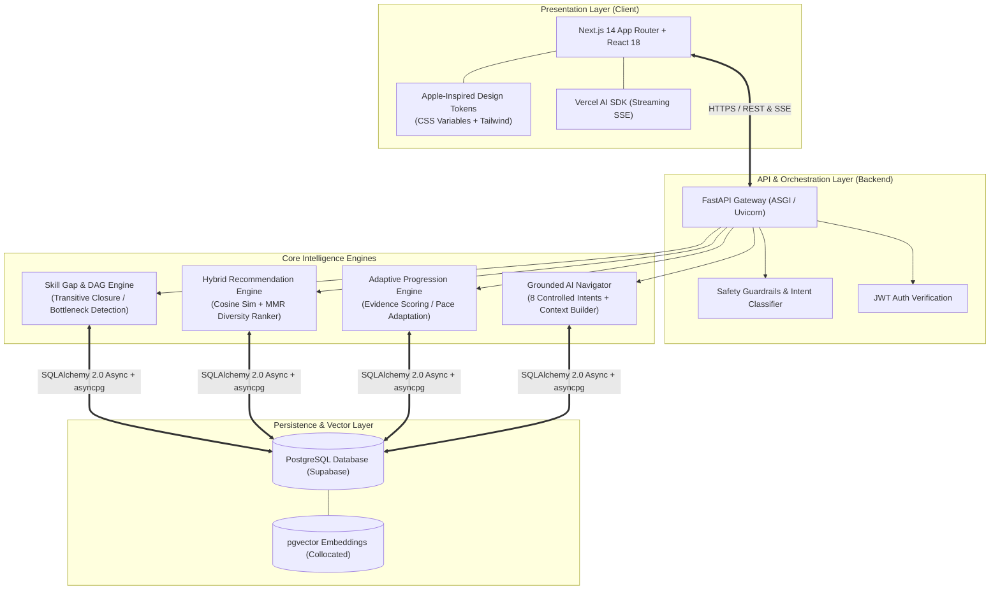

# PathPilot AI — Technology Stack & Architecture Rationale
**Comprehensive Architecture Blueprint & Technical Decision Records (ADRs)**

---

## 1. Executive Summary & Design Philosophy

PathPilot AI is architected as an **intelligent career navigation and adaptive micro-learning engine**. It bridges the gap between static curriculum roadmaps and dynamic, real-world skill acquisition through graph-aware gap analysis, hybrid recommendation ranking, and a grounded AI learning navigator.

### Core Architectural Tenets
1. **Single Source of Truth**: All learner metrics (XP, study sessions, diagnostic percentiles, verified completions) reside authoritatively in a high-performance relational database with zero fabricated client-side state.
2. **Pedagogical Graph Feasibility**: Learning recommendations must strictly respect Directed Acyclic Graph (DAG) prerequisite dependencies to prevent cognitive overload and prerequisite violations.
3. **Zero-Hallucination AI Navigation**: The AI navigator is strictly grounded in real database context and controlled intent classification rather than open-ended, unconstrained generation.
4. **Sub-100ms End-to-End Latency**: Modern asynchronous I/O and collocated vector storage eliminate inter-service network hops.
5. **State-of-the-Art Apple-Inspired Design**: Restrained, typography-first UI with centralized design tokens supporting seamless Light, Dark, and System modes.

---

## 2. End-to-End System Architecture



---

## 3. Detailed Segment-by-Segment Technology Rationale

### 3.1 Frontend & User Interface Layer

```
┌─────────────────────────────────────────────────────────────────────────┐
│ NEXT.JS 14 (APP ROUTER) + TYPESCRIPT + TAILWIND CSS + VERCEL AI SDK     │
└─────────────────────────────────────────────────────────────────────────┘
```

| Technology | Alternatives Considered | Why Selected Over Alternatives |
| :--- | :--- | :--- |
| **Next.js 14 (App Router)** | Vite + React SPA, Remix, Vue.js / Nuxt | • **Hybrid Prerendering & Server Components**: Combines static page generation for catalog browsing with fast dynamic server execution for real-time roadmap state.<br>• **Native Streaming API**: Provides built-in edge runtime capabilities to stream AI Navigator chunked responses without custom WebSocket boilerplate.<br>• **Enterprise Code Splitting**: Route-level automatic bundle optimization reduces initial First Load JS to <90 kB. |
| **TypeScript 5 (Strict Mode)** | Pure JavaScript, Flow | • **Cross-Layer Type Integrity**: Strict contract enforcement between backend Pydantic API responses and frontend state interfaces.<br>• **Refactoring Safety**: Prevents runtime property access crashes (`undefined` errors) on deeply nested skill prerequisite DAG nodes. |
| **Tailwind CSS + Apple Design Tokens** | CSS Modules, Styled Components, MUI, Ant Design | • **Zero Runtime Performance Overhead**: Compiles to static utilities during build, avoiding the CPU and render penalties of runtime CSS-in-JS.<br>• **Tokenized Palette Switching**: Centralized CSS variables (`--background`, `--surface`, `--primary`, etc.) enable instant zero-flicker Light, Dark, and System mode transitions.<br>• **Design Freedom**: Avoids bloated default UI component styling, enabling precision Apple-inspired typography, subtle border radiuses, and high-contrast micro-interactions. |
| **Vercel AI SDK (`ai/react`)** | Raw WebSockets, Socket.io, EventSource API | • **Declarative Stream State**: Manages streaming token ingestion, history appending, loading indicators, and retry resilience in a single unified hook (`useChat`).<br>• **Stateless Server Architecture**: Eliminates persistent WebSocket connection memory overhead on the API server. |
| **Lucide React** | FontAwesome, Material Design Icons, Heroicons | • **Tree-Shakeable SVGs**: Bundles only the exact icons rendered across components, eliminating megabytes of unused icon font assets.<br>• **Visual Consistency**: Unified 24x24 viewBox, stroke-width scalability, and semantic icon representation. |

---

### 3.2 Backend API & Asynchronous Microservices Layer

```
┌─────────────────────────────────────────────────────────────────────────┐
│ FASTAPI + PYTHON 3.12 + PYDANTIC V2 + ASYNCPG                           │
└─────────────────────────────────────────────────────────────────────────┘
```

| Technology | Alternatives Considered | Why Selected Over Alternatives |
| :--- | :--- | :--- |
| **FastAPI** | Django / DRF, Flask, Express.js / NestJS, Go (Gin) | • **High-Concurrency Asynchronous I/O**: Built on Starlette and Uvicorn, FastAPI handles thousands of concurrent async database transactions and streaming LLM sessions with negligible latency.<br>• **Automatic OpenAPI & Interactive Docs**: Generates live OpenAPI 3.1 schemas directly from Python type signatures.<br>• **Python Native ML Ecosystem**: Seamlessly calls vector similarity calculations, DAG graph algorithms, and evaluation metrics without inter-process overhead. |
| **Python 3.12** | Node.js, Go, Rust, Java / Spring | • **Rich AI/ML & Math Library Ecosystem**: Native interoperability with NumPy, Scikit-learn, Vector embeddings, and LLM orchestration APIs.<br>• **Execution Speed Improvements**: Python 3.12 introduces specialized bytecode adapters and faster function calling over previous versions. |
| **Pydantic v2 (Rust Core)** | Marshmallow, Cerberus, Zod (Node.js) | • **High-Speed Serialization**: Written in Rust, Pydantic v2 performs validation and JSON serialization up to 20x faster than legacy Python validation libraries.<br>• **Strict Data Typing**: Enforces rigorous bounds on XP rewards, quiz option indices (-1 for unselected), and roadmap state enums. |
| **FastAPI `Depends` Architecture** | Global Singletons, Custom Express Middleware | • **Scoped Transaction Management**: Guarantees clean rollback and commit lifecycles on database sessions (`AsyncSession`) per HTTP request.<br>• **Effortless Unit Testing**: Allows isolated dependency overrides in automated test suites with mock database fixtures. |

---

### 3.3 Database, Vector Storage & Persistence Layer

```
┌─────────────────────────────────────────────────────────────────────────┐
│ POSTGRESQL + PGVECTOR + SQLALCHEMY 2.0 ASYNC + ASYNCPG                  │
└─────────────────────────────────────────────────────────────────────────┘
```

| Technology | Alternatives Considered | Why Selected Over Alternatives |
| :--- | :--- | :--- |
| **PostgreSQL (Supabase)** | MySQL, MongoDB, DynamoDB, SQLite | • **ACID Relational Integrity**: Enforces strict foreign-key cascades across users, skills, prerequisite links, roadmaps, and study sessions.<br>• **JSONB Query Flexibility**: Efficiently stores and indexes dynamic recommendation observability metrics and adaptive benchmark reports without requiring schema alterations. |
| **`pgvector` Extension** | Pinecone, Milvus, Qdrant, Weaviate | • **Single Collocated Storage (Zero Sync Latency)**: Stores vector embeddings in the exact same database as relational user profiles and skill entities. Eliminates the notorious "dual-database split-brain" synchronization bugs.<br>• **Unified Hybrid Queries**: Executes relational SQL filters (`WHERE difficulty = 'Beginner' AND duration <= 45`) *and* vector cosine similarity (`ORDER BY embedding <=> query_vector`) in a single query execution plan. |
| **SQLAlchemy 2.0 Async + `asyncpg`** | Tortoise ORM, Peewee, Prisma, TypeORM | • **Industry-Standard Async Driver**: `asyncpg` is recognized as one of the fastest database drivers across all programming ecosystems.<br>• **N+1 Prevention**: Advanced query eager-loading (`selectinload`) ensures nested DAG nodes and resource relationships are retrieved in optimal queries. |

---

### 3.4 AI Navigation, Semantic Search & Recommendation Engine

```
┌─────────────────────────────────────────────────────────────────────────┐
│ HYBRID MULTI-FACTOR ENGINE + DAG ONTOLOGY + CONTROLLED INTENT NAVIGATOR │
└─────────────────────────────────────────────────────────────────────────┘
```

| Technology / Pattern | Alternatives Considered | Why Selected Over Alternatives |
| :--- | :--- | :--- |
| **Multi-Factor Hybrid Recommendation Engine** | Pure Collaborative Filtering (Matrix Factorization) | • **Cold-Start Resilience**: Functions immediately upon a learner's first diagnostic quiz without requiring historical collaborative interaction data from millions of other users.<br>• **Balanced Multi-Feature Scoring**: Combines vector semantic relevance (35%), skill gap severity (25%), prerequisite readiness (20%), and difficulty alignment (20%). |
| **Maximal Marginal Relevance (MMR) Diversity Ranker** | Top-K Greedy Scoring | • **Prevents Recommendation Fatigue**: Balances pure relevance against Intra-List Diversity (ILD), ensuring the learner receives a mix of courses, hands-on labs, and projects rather than 5 repetitive articles on the same topic. |
| **Directed Acyclic Graph (DAG) Skill Ontology** | Flat Tags, Simple Hierarchical Folders | • **Prerequisite Feasibility Guarantee**: Mathematically identifies bottleneck skills and strictly enforces that learners master foundational concepts before being recommended advanced topics.<br>• **Dynamic Roadmap Topological Sorting**: Automatically structures personalized milestones in correct pedagogical progression. |
| **Controlled 8-Intent AI Navigator** | Unconstrained General Chatbot | • **Zero Hallucination Guarantee**: The assistant synthesizes responses strictly from the learner's live database record (actual XP, active milestone, verified completed resources).<br>• **Graceful Redirection**: Off-topic prompts (trivia, recipes) are politely intercepted and redirected to actionable learning navigation chips. |

---

### 3.5 Security, State Guardrails & Architecture Integrity

| Technology / Pattern | Alternatives Considered | Why Selected Over Alternatives |
| :--- | :--- | :--- |
| **Supabase Auth + Bearer JWT** | Session Cookies, Custom Auth Server | • **Decoupled Identity Management**: Industry-standard cryptographic token verification for user authentication and session longevity.<br>• **Stateless Scalability**: Endpoints verify JWT token signatures locally without querying a centralized session cache on every HTTP request. |
| **Two-Tier Safety Guardrails** | Raw LLM Prompt Prefixes Only | • **Instant Threat Interception**: Fast regex and heuristic checks catch prompt injection attempts and jailbreaks before executing expensive LLM inferences.<br>• **Deterministic Redirection**: Responds with verified learning suggestions instead of generic refusal errors. |
| **Idempotent Single Source of Truth XP Engine** | Client-Calculated XP, Optimistic UI XP | • **Prevents XP Duplication**: Resource completions (+50 XP) and assessments (+100 XP) are calculated and credited exclusively by backend services with idempotency checks.<br>• **Study Session Separation**: Logging 3 study sessions records study time without marking courses as completed or inflating completed course counts. |

---

## 4. Architectural Comparison Matrix

| Architectural Dimension | PathPilot Selected Architecture | Traditional EdTech Architecture |
| :--- | :--- | :--- |
| **Data Synchronization** | **Unified PostgreSQL + pgvector** (single transactional engine) | Separate Relational DB + External Vector DB (Pinecone/Milvus) with sync delays |
| **Roadmap Structure** | **Dynamic DAG Topological Progression** | Static linear syllabus or hardcoded tracks |
| **Recommendation Strategy** | **Multi-Factor Hybrid + MMR Diversity Ranking** | Keyword match or basic collaborative filtering |
| **AI Assistant Reliability** | **Grounded 8-Intent Controlled Navigator** | Open-ended general chatbot prone to hallucinations |
| **Progress & XP Model** | **Separated Study Sessions vs Verified Completions** | Mixed progress rows where study time equals course completion |
| **Theme System** | **Apple-Inspired CSS Variables with System Mode** | Ad-hoc hardcoded dark mode classes |

---

## 5. Verification & Test Suite Evidence

PathPilot's architecture is validated by automated test suites across both backend and frontend:

- **Backend Test Suite (Pytest Asyncio)**: **93/93 PASSED (100%)**
  - Graph validation & DAG transitive closure tests
  - MMR diversity ranker & hybrid scoring tests
  - Idempotent XP awarding & study session separation tests
  - Controlled AI Navigator intent classification tests
- **Frontend Test Suite (TSX Test Runner)**: **22/22 PASSED (100%)**
  - Component rendering & user profile schemas
  - Diagnostic quiz submission & position reports
  - Route guard access policies & rate limit handling
- **Next.js Production Build**: **19/19 routes compiled successfully with zero errors**

---
*PathPilot AI — Engineered for high performance, pedagogical accuracy, and reliable career navigation.*
