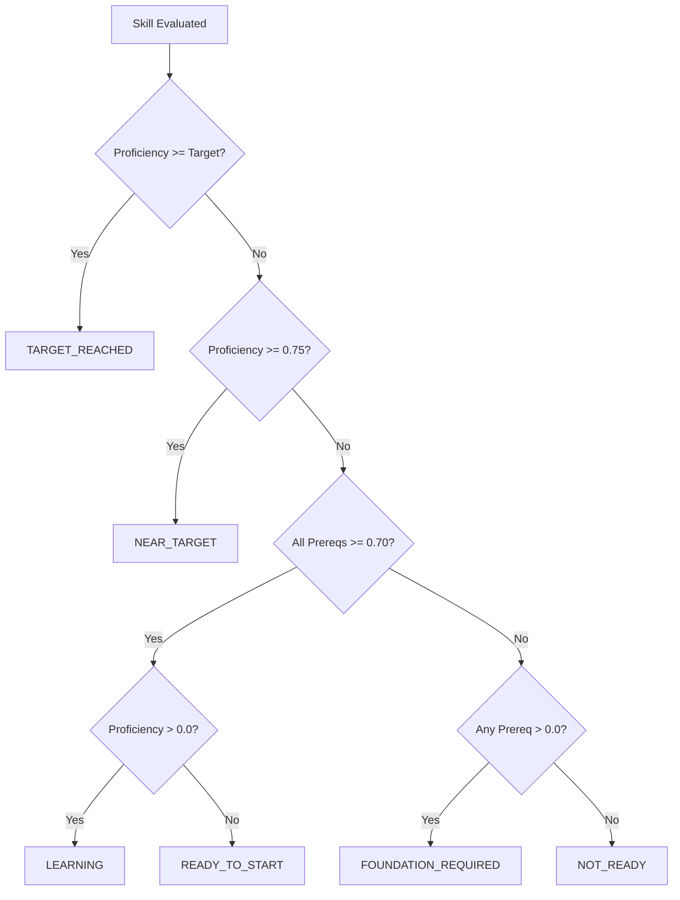

# PathPilot AI — Intelligent Skill-Gap Engine

## 1. Executive Summary

A skill gap is **not** simply $\text{Target Score} - \text{Current Score}$. 
PathPilot's Skill-Gap Engine combines **prerequisite structure**, **career importance**, **learner readiness**, and **downstream unlock impact** to prioritize learning actions that maximize momentum and unblock critical career paths.

```
                    ┌─────────────────────────┐
                    │  Learner Skill State    │
                    │ (Proficiency & Evidence)│
                    └───────────┬─────────────┘
                                │
                                ▼
                    ┌─────────────────────────┐
                    │ Evidence Weighting &    │
                    │ Conflict Resolution     │
                    └───────────┬─────────────┘
                                │
                                ▼
                    ┌─────────────────────────┐
                    │  Prerequisite Gate &    │
                    │  Bottleneck Detection   │
                    └───────────┬─────────────┘
                                │
                                ▼
                    ┌─────────────────────────┐
                    │ Multi-Factor Priority   │
                    │ Scoring & Readiness     │
                    └─────┬─────────────┬─────┘
                          │             │
        ┌─────────────────▼──┐       ┌──▼──────────────────┐
        │ Career Readiness % │       │ Next Best Skill Hero│
        │ & Blocker Penalty  │       │ & Grounded XAI Expl.│
        └────────────────────┘       └─────────────────────┘
```

---

## 2. Multi-Source Evidence Weighting & Conflict Resolution

Learner proficiencies are normalized to the interval $[0.0, 1.0]$:
$$\text{Proficiency} = \frac{\text{Score}}{100.0}$$

### 2.1 Evidence Hierarchy & Reliability Weights
| Evidence Source | Reliability Weight ($w_e$) | Confidence Boost ($c_e$) |
|---|---|---|
| **Assessment** (Diagnostic / Quiz) | $1.00$ | $0.90$ |
| **Practice** (Coding lab / exercise) | $0.85$ | $0.80$ |
| **Resource** (Completed material) | $0.70$ | $0.65$ |
| **Self-Report** (Onboarding survey) | $0.40$ | $0.35$ |
| **Inferred** (Cold-start assumption) | $0.25$ | $0.20$ |

### 2.2 Conflicting Evidence Resolution
When a learner self-reports high competence ($\ge 0.80$) but fails a diagnostic assessment ($< 0.50$):
$$\text{Resolved Proficiency} = \frac{w_{\text{ass}} \times \text{prof}_{\text{ass}} + w_{\text{self}} \times \text{prof}_{\text{self}}}{w_{\text{ass}} + w_{\text{self}}} = \frac{1.0 \times 0.35 + 0.40 \times 0.90}{1.40} = 0.507$$
The assessment score dominates, confidence is calibrated to $0.85$, and the conflict flag is logged.

---

## 3. Bottleneck & Blocker Detection

### 3.1 Prerequisite Gate
A prerequisite $P$ for skill $S$ is satisfied if and only if:
$$\text{Proficiency}(P) \ge 0.70 \quad (\text{Display Score} \ge 70\%)$$

### 3.2 Bottleneck Classification
Skill $B$ is classified as a **Key Bottleneck** if:
1. Current proficiency is weak ($\text{Proficiency}(B) < 0.70$ or $\text{Raw Gap} \ge 0.25$).
2. It has high downstream impact ($\text{Impact}(B) \ge 0.35$ or unlocks $\ge 1$ career skills).
3. Direct prerequisites of $B$ itself are satisfied ($\ge 0.70$), making it actionable immediately.

---

## 4. Readiness State Machine

Each skill in the target career is assigned one of six deterministic readiness states:



---

## 5. Intelligent Priority Scoring Formula

The multi-factor priority score $P(S) \in [0.0, 1.0]$ balances gap size, career weight, downstream impact, and readiness:

$$\text{Base Priority} = 0.35 \times \frac{\text{Raw Gap}}{\text{Target}} + 0.30 \times C_{\text{imp}} + 0.25 \times \text{Impact}(S) + 0.10 \times C_{\text{weight}}$$

$$\text{Intelligent Priority} = \min\left(1.0, \max\left(0.0, \text{Base Priority} \times M_{\text{readiness}} + B_{\text{bonus}}\right)\right)$$

Where:
- $C_{\text{imp}} \in \{1.00 \text{ (Critical)}, 0.75 \text{ (High)}, 0.50 \text{ (Medium)}, 0.25 \text{ (Low)}\}$.
- $M_{\text{readiness}} = 1.00$ if all prerequisites are met; $0.35$ if blocked by unsatisfied prerequisites.
- $B_{\text{bonus}} = +0.20$ if the skill is an actionable unblocking bottleneck.

---

## 6. Career Readiness Metric & Next Best Skill

### 6.1 Career Readiness Percentage
$$\text{Readiness} = \left(\sum_{S \in \text{CareerSkills}} C_{\text{weight}}(S) \times \min(1.0, \frac{\text{Proficiency}(S)}{\text{Target}(S)})\right) \times (1.0 - 0.05 \times N_{\text{blockers}})$$
*Penalizes readiness if active bottlenecks block downstream progress.*

### 6.2 Authoritative Next Best Skill Selection
Selects the skill with maximum $\text{Intelligent Priority}$ subject to $\text{Prerequisites Met} = \text{True}$.
Generates natural language explainability reasons (e.g., *"Prioritized as your key prerequisite bottleneck for Statistics. Improving to 85% unlocks 4 downstream competencies."*).
